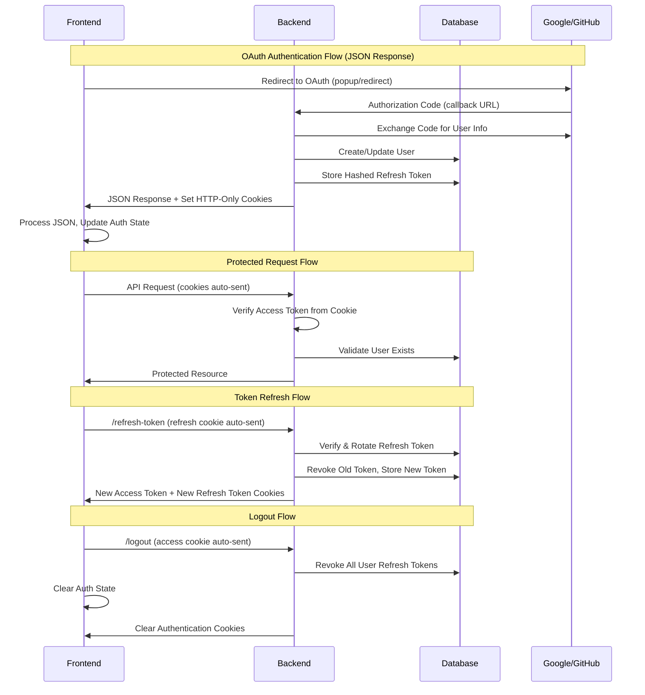

# Design Document

## Overview

This design addresses critical bugs in the authentication system migration and establishes a secure, cookie-based authentication flow. The solution fixes import errors, token rotation logic, secret management inconsistencies, and implements proper session management while migrating the frontend from localStorage to HTTP-only cookies.

## Architecture

### Current State Analysis

**Backend Issues Identified:**

- Missing `crypto` import in `tokenService.js` causing runtime errors
- Missing `tokenService` import in `authController.js` breaking refresh endpoint
- Inconsistent JWT secret usage between modules
- Broken token rotation logic (searching for unhashed tokens in database)
- Incomplete logout implementation
- Unused `COOKIE_SECRET` environment variable

**Frontend Migration Needed:**

- Remove localStorage-based token storage
- Remove Authorization header token transmission
- Implement cookie-based authentication flow
- Add automatic token refresh logic
- Update authentication state management
- Handle JSON responses from OAuth callbacks instead of redirects
- Implement proper OAuth flow with popup/redirect handling for JSON responses

### Target Architecture



## Components and Interfaces

### Backend Components

#### 1. Token Service (`tokenService.js`)

**Fixes Required:**

- Add missing `crypto` import
- Fix `rotateRefreshToken` to hash tokens before database lookup
- Standardize JWT secret usage

**Enhanced Interface:**

```javascript
{
  generateAccessToken(userId): string
  generateRefreshToken(userId, userAgent): Promise<string>
  verifyAccessToken(token): object|null
  verifyRefreshToken(token): Promise<object|null>
  rotateRefreshToken(userId, oldToken, userAgent): Promise<string>
  revokeAllUserTokens(userId): Promise<void>
  setTokenCookies(res, tokens): void
  clearTokenCookies(res): void
}
```

#### 2. Auth Controller (`authController.js`)

**Fixes Required:**

- Add missing `tokenService` import
- Implement proper logout with token revocation
- Remove unused `frontendUrl` variable

**Enhanced Interface:**

```javascript
{
  googleOneTap(req, res): Promise<void>
  googleAuth(req, res): Promise<void>
  githubAuth(req, res): Promise<void>
  getMe(req, res): void
  refreshToken(req, res): Promise<void>
  logout(req, res): Promise<void>  // Enhanced implementation
}
```

#### 3. Auth Middleware (`auth.js`)

**Fixes Required:**

- Standardize JWT secret usage with tokenService

#### 4. Configuration (`oauth.js`)

**Enhancements:**

- Remove unused COOKIE_SECRET reference
- Ensure consistent secret exports

### Frontend Components

#### 1. Authentication Context

**New Implementation:**

```javascript
{
  user: User|null
  isAuthenticated: boolean
  isLoading: boolean
  login(): void
  logout(): Promise<void>
  refreshToken(): Promise<boolean>
  checkAuthStatus(): Promise<void>
  handleOAuthCallback(response): void  // New: Handle JSON OAuth response
}
```

#### 2. OAuth Handler Components

**New Implementation Required:**

- OAuth popup/redirect handler for JSON responses
- OAuth callback processor for Google/GitHub
- Error handling for OAuth failures
- Integration with authentication context

#### 3. API Client

**Migration Required:**

- Remove Authorization header logic
- Add automatic token refresh on 401 responses
- Implement cookie-based request handling

#### 4. Protected Route Component

**Updates Required:**

- Use authentication context instead of localStorage
- Handle loading states during auth checks

## Data Models

### Refresh Token Model (Existing - No Changes)

```prisma
model RefreshToken {
  id        String    @id @default(uuid())
  token     String    @unique  // Hashed token value
  userId    String
  user      User      @relation(fields: [userId], references: [id], onDelete: Cascade)
  userAgent String?
  expiresAt DateTime
  revokedAt DateTime?
  createdAt DateTime  @default(now())
  @@index([userId])
}
```

### Environment Variables Cleanup

**Remove:**

- `COOKIE_SECRET` (unused)

**Keep:**

- `JWT_ACCESS_SECRET`
- `JWT_REFRESH_SECRET`

## Error Handling

### Backend Error Scenarios

1. **Token Rotation Failures**

   - Invalid refresh token → Clear cookies, return 401
   - Database errors → Log error, return 500
   - Concurrent rotation → Handle gracefully with proper locking

2. **Authentication Failures**

   - Expired access token → Return 401 with TOKEN_EXPIRED code
   - Invalid token → Return 401 with INVALID_TOKEN code
   - User not found → Return 401 with USER_NOT_FOUND code

3. **Logout Failures**
   - Database errors during token revocation → Log but still clear cookies
   - Missing refresh token → Still return success (idempotent operation)

### Frontend Error Scenarios

1. **Authentication State Management**

   - 401 responses → Attempt token refresh once, then redirect to login
   - Network errors → Show appropriate error messages
   - Refresh failures → Clear auth state, redirect to login

2. **Cookie Handling**
   - Missing cookies → Treat as unauthenticated
   - Malformed cookies → Let backend handle validation

## Testing Strategy

### Backend Testing

1. **Unit Tests**

   - Token generation and verification
   - Token rotation logic with proper hashing
   - Cookie setting and clearing
   - Error handling scenarios

2. **Integration Tests**
   - Complete authentication flows
   - Token refresh workflows
   - Logout functionality
   - Concurrent session management

### Frontend Testing

1. **Component Tests**

   - Authentication context behavior
   - Protected route access control
   - Login/logout user interactions
   - OAuth callback handling with JSON responses

2. **Integration Tests**
   - End-to-end authentication flows with JSON OAuth responses
   - Automatic token refresh scenarios
   - Error handling and recovery
   - OAuth popup/redirect flow testing

### Security Testing

1. **Token Security**

   - Verify tokens are properly hashed in database
   - Test token rotation prevents reuse
   - Validate cookie security flags

2. **Session Management**
   - Test multi-device session handling
   - Verify proper token revocation
   - Test logout from all devices functionality

## Implementation Phases

### Phase 1: Backend Bug Fixes

- Fix critical import errors
- Repair token rotation logic
- Standardize secret management
- Implement proper logout

### Phase 2: Frontend Migration

- Remove localStorage dependencies
- Implement cookie-based auth context
- Add automatic token refresh
- Update API client

### Phase 3: Testing & Validation

- Comprehensive testing suite
- Security validation
- Performance testing
- Documentation updates

## Security Considerations

1. **Cookie Security**

   - HTTP-only prevents XSS access
   - Secure flag for HTTPS in production
   - SameSite=lax prevents CSRF attacks

2. **Token Management**

   - Short-lived access tokens (15 minutes)
   - Refresh token rotation prevents reuse attacks
   - Database storage enables revocation

3. **Error Handling**
   - No sensitive information in error messages
   - Consistent error responses
   - Proper logging for security monitoring
