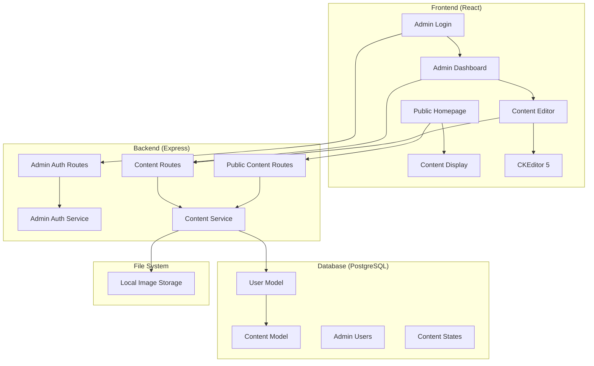
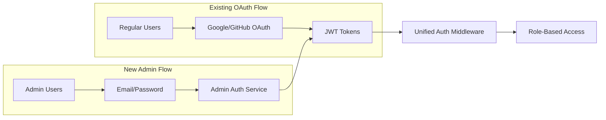
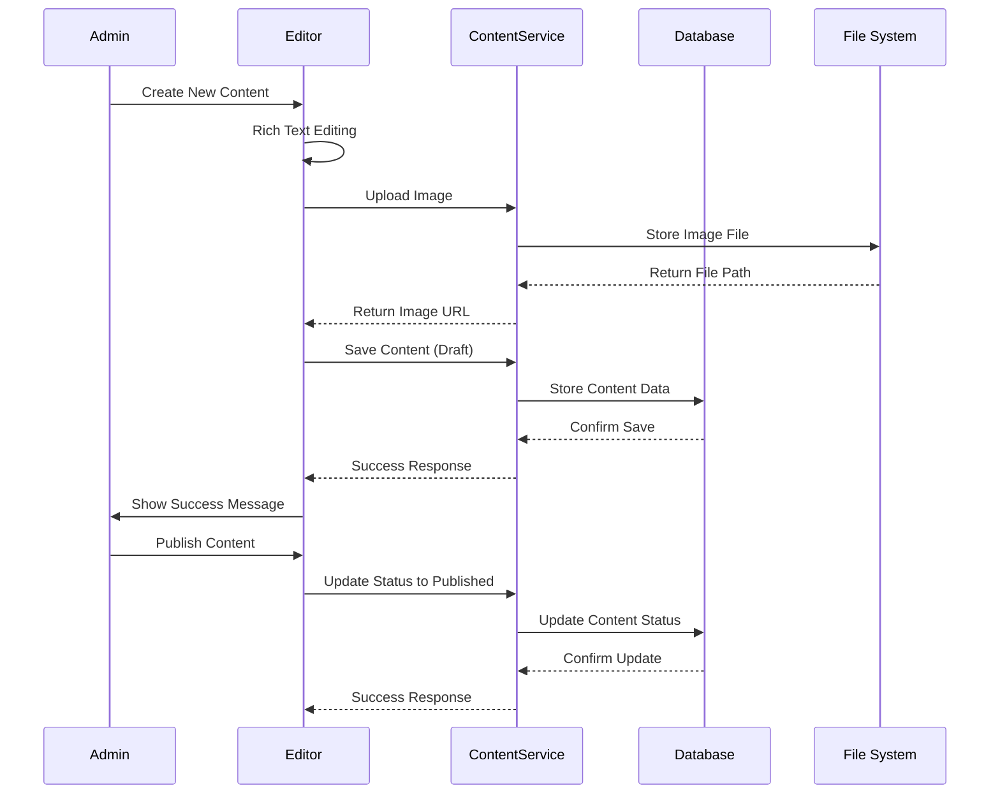

# Design Document

## Overview

The Content Writing System extends the existing Intellectify platform with comprehensive content management capabilities. The system introduces admin-specific authentication, rich text editing with CKEditor 5, content state management, and public content display. The design leverages the existing authentication infrastructure while adding new admin-only features and content models.

## Architecture

### High-Level Architecture



### Authentication Architecture

The system extends the existing OAuth-based authentication with admin-specific email/password authentication:



## Components and Interfaces

### Backend Components

#### 1. Database Models

**Updated User Model**

```prisma
model User {
  id        String   @id @default(uuid())
  email     String   @unique
  name      String
  avatar    String?
  role      Role     @default(REGULAR)

  // OAuth fields (nullable for admin users)
  provider          OAuthProvider?
  providerAccountId String?

  // Admin authentication (nullable for OAuth users)
  password          String?  // Hashed password for admin users

  // Relations
  refreshTokens     RefreshToken[]
  content          Content[]

  createdAt DateTime @default(now())
  updatedAt DateTime @updatedAt

  @@unique([provider, providerAccountId])
  @@map("users")
}
```

**New Content Model**

```prisma
model Content {
  id          String      @id @default(uuid())
  title       String
  content     String      // Rich text content from CKEditor
  excerpt     String?     // Optional short description
  status      ContentStatus @default(DRAFT)
  priority    Int         @default(0)  // Custom ordering priority

  // Metadata
  authorId    String
  author      User        @relation(fields: [authorId], references: [id])
  category    String?     // Future: will be normalized to Category model
  subcategory String?     // Future: will be normalized to Subcategory model

  // SEO and display
  slug        String      @unique  // URL-friendly version of title
  metaTitle   String?
  metaDescription String?

  // Timestamps
  createdAt   DateTime    @default(now())
  updatedAt   DateTime    @updatedAt
  publishedAt DateTime?   // When content was first published

  @@index([status, priority, createdAt])
  @@index([authorId])
  @@map("content")
}

enum ContentStatus {
  DRAFT
  PUBLISHED
}
```

#### 2. Admin Authentication Service

**AdminAuthService**

- Handles email/password authentication for admin users
- Integrates with existing JWT token system
- Provides secure password hashing using bcrypt
- Validates admin credentials and generates tokens

```javascript
class AdminAuthService {
  async authenticateAdmin(email, password)
  async createAdmin(email, password, name) // Script-only function
  async validateAdminCredentials(email, password)
  async hashPassword(password)
}
```

#### 3. Content Management Service

**ContentService**

- Manages CRUD operations for content
- Handles content state transitions (draft → published)
- Manages image uploads and URL generation
- Provides basic content retrieval

```javascript
class ContentService {
  async createContent(authorId, contentData)
  async updateContent(contentId, contentData, authorId)
  async deleteContent(contentId, authorId)
  async getContentById(contentId)
  async getContentByAuthor(authorId)
  async getPublishedContent()
  async uploadImage(file)
  async generateSlug(title)
}
```

#### 4. Image Management Service

**ImageService**

- Handles local file storage for uploaded images
- Generates unique filenames to prevent conflicts
- Provides URL generation for stored images
- Manages file cleanup when content is deleted

```javascript
class ImageService {
  async saveImage(file, contentId, category)
  async deleteImage(imagePath)
  async generateImageUrl(imagePath)
  async cleanupContentImages(contentId)
  async generateImagePath(category, contentId, filename)
}
```

### Frontend Components

#### 1. Admin Authentication Components

**AdminLogin Component**

- Dedicated login form for admin users
- Email/password input fields with validation
- Integration with existing AuthContext
- Error handling and loading states

**AdminRoute Component**

- Protected route wrapper for admin-only pages
- Checks user role and authentication status
- Redirects non-admin users to appropriate pages

#### 2. Content Management Components

**AdminDashboard Component**

- Central hub for content management
- Displays list of admin's content (title, status, date)
- "Create New Content" button
- Individual actions per content (Edit, Delete buttons)
- Simple, clean interface without filtering/sorting

**ContentEditor Component**

- Rich text editor using CKEditor 5
- Image upload integration
- Content metadata management (title, category, priority)
- Preview functionality
- Draft/publish state management

#### 3. Public Display Components

**HomePage Component (Enhanced)**

- Displays published content in chronological order (newest first)
- Category sidebar navigation
- Simple content cards layout
- Responsive design

**ContentDisplay Component**

- Full content rendering with rich text formatting
- Image display with proper sizing
- Metadata display (author, date, category)
- Clean reading experience

**CategorySidebar Component**

- Lists available content categories
- Simple category navigation
- Responsive design

## Data Models

### Content Data Flow



### Image Storage Strategy

**Local Storage Structure**

```
uploads/
├── content/
│   ├── technology/
│   │   ├── 2024/
│   │   │   ├── 01/
│   │   │   │   ├── content-uuid-1/
│   │   │   │   │   ├── image-1.jpg
│   │   │   │   │   └── image-2.png
│   │   │   │   └── content-uuid-2/
│   │   │   └── 02/
│   ├── education/
│   │   ├── 2024/
│   │   │   └── 01/
│   ├── general/  # Default category for uncategorized content
│   │   ├── 2024/
│   └── temp/  # Temporary uploads before content save
```

**Database Storage**

- Only image URLs/paths stored in database
- Content model contains rich text with embedded image URLs
- Separate image metadata table for future S3 migration

## Error Handling

### Backend Error Handling

**Admin Authentication Errors**

- Invalid credentials: 401 Unauthorized
- Account not found: 401 Unauthorized
- Account locked: 423 Locked
- Server errors: 500 Internal Server Error

**Content Management Errors**

- Unauthorized access: 403 Forbidden
- Content not found: 404 Not Found
- Validation errors: 400 Bad Request
- Image upload errors: 413 Payload Too Large, 415 Unsupported Media Type

**Error Response Format**

```javascript
{
  success: false,
  error: "Error message",
  code: "ERROR_CODE",
  details: {}, // Additional error context
  timestamp: "2024-01-15T10:30:00Z"
}
```

### Frontend Error Handling

**Global Error Boundary**

- Catches React component errors
- Displays user-friendly error messages
- Logs errors for debugging
- Provides recovery options

**Form Validation**

- Real-time validation for admin login
- Content editor validation (title, content length)
- Image upload validation (size, type)
- User feedback with specific error messages

## Testing Strategy

### Backend Testing

**Unit Tests**

- AdminAuthService authentication logic
- ContentService CRUD operations
- ImageService file handling
- Password hashing and validation

**Integration Tests**

- Admin authentication flow
- Content creation and publishing workflow
- Image upload and storage
- Database model relationships

**API Tests**

- Admin login endpoints
- Content management endpoints
- Public content display endpoints
- Error handling scenarios

### Frontend Testing

**Component Tests**

- AdminLogin form validation and submission
- ContentEditor functionality and state management
- AdminDashboard content listing and actions
- Public content display

**Integration Tests**

- Admin authentication flow
- Content creation and editing workflow
- Image upload integration
- Navigation and routing

**E2E Tests**

- Complete admin workflow (login → create content → publish)
- Public content viewing
- Error scenarios and recovery
- Cross-browser compatibility

### Security Testing

**Authentication Security**

- Password strength validation
- Brute force protection
- Session management
- Token security

**Authorization Testing**

- Admin-only endpoint protection
- Content ownership validation
- Role-based access control
- CSRF protection

**Input Validation**

- XSS prevention in rich text content
- SQL injection prevention
- File upload security
- Content sanitization

## Performance Considerations

### Database Optimization

**Indexing Strategy**

- Content status and priority for homepage queries
- Author ID for admin content lists
- Created date for chronological sorting
- Full-text search preparation (future)

**Query Optimization**

- Pagination for content lists
- Selective field loading
- Efficient joins for content with author data
- Caching strategy for public content

### Frontend Performance

**Code Splitting**

- Lazy load admin components
- Separate bundles for public and admin features
- CKEditor 5 dynamic imports

**Image Optimization**

- Responsive image serving
- Lazy loading for content images
- Image compression and resizing
- CDN preparation for future S3 migration

**Caching Strategy**

- Browser caching for static assets
- API response caching for public content
- Local storage for admin preferences
- Service worker for offline capability (future)

## Security Architecture

### Admin Authentication Security

**Password Security**

- bcrypt hashing with salt rounds ≥ 12
- Password strength requirements
- Account lockout after failed attempts
- Secure password reset flow (future)

**Session Security**

- HTTP-only cookies for token storage
- Secure cookie flags in production
- Token rotation on refresh
- Session timeout and cleanup

### Content Security

**Input Sanitization**

- HTML sanitization for rich text content
- XSS prevention in user-generated content
- File upload validation and scanning
- Content Security Policy headers

**Access Control**

- Admin-only content management endpoints
- Content ownership validation
- Role-based permissions
- API rate limiting

### File Upload Security

**Upload Validation**

- File type whitelist (images only)
- File size limits
- Filename sanitization
- Virus scanning preparation

**Storage Security**

- Secure file permissions
- Directory traversal prevention
- Unique filename generation
- Regular cleanup of orphaned files

## Migration and Deployment

### Database Migration Strategy

**Schema Updates**

1. Add nullable password field to User model
2. Make OAuth fields nullable
3. Create Content model with indexes
4. Add ContentStatus enum
5. Update existing user data validation

**Data Migration**

- Existing OAuth users remain unchanged
- Admin users created via secure script
- Content model starts empty
- Image storage directory creation

### Deployment Considerations

**Environment Configuration**

- Admin creation script environment variables
- Image storage path configuration
- CKEditor 5 license configuration (if needed)
- Security headers and CORS updates

**Monitoring and Logging**

- Admin authentication attempts
- Content creation and publishing events
- Image upload activities
- Error tracking and alerting

This design provides a comprehensive foundation for implementing the Content Writing System while maintaining security, performance, and scalability considerations.
